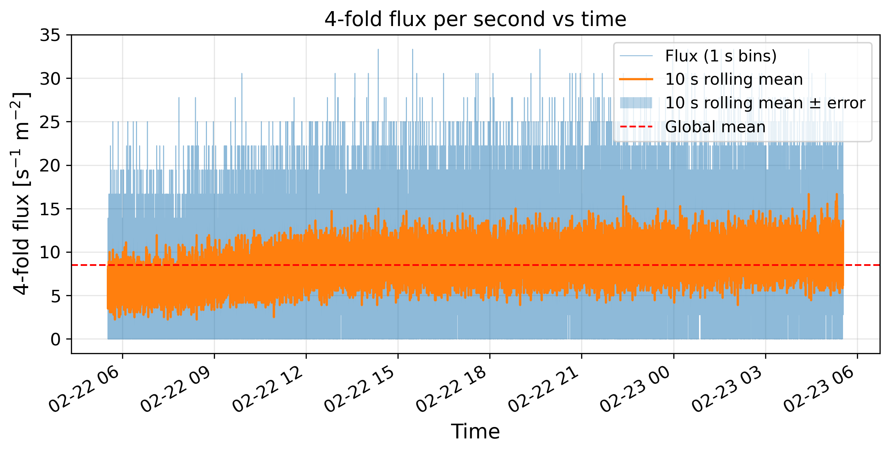
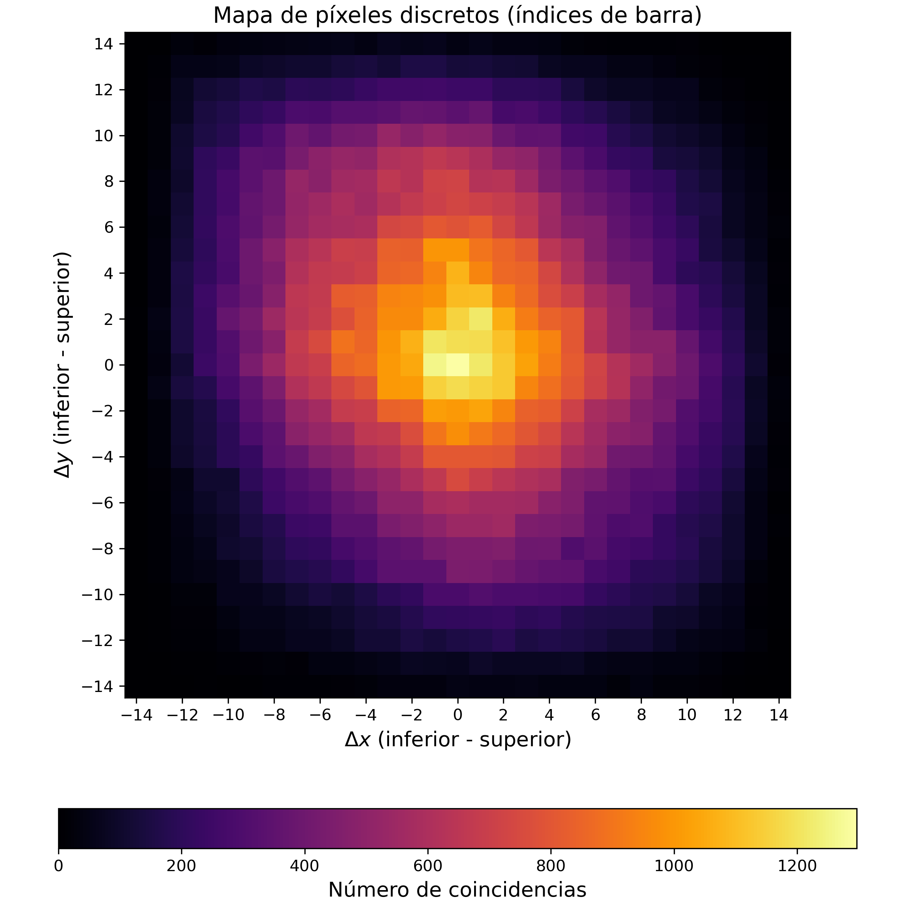
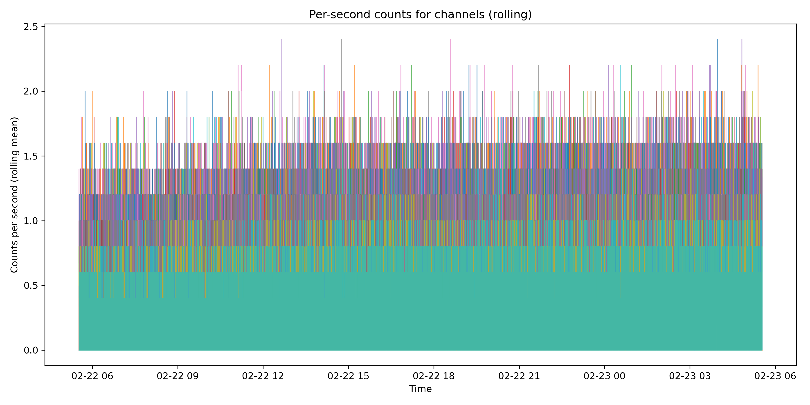
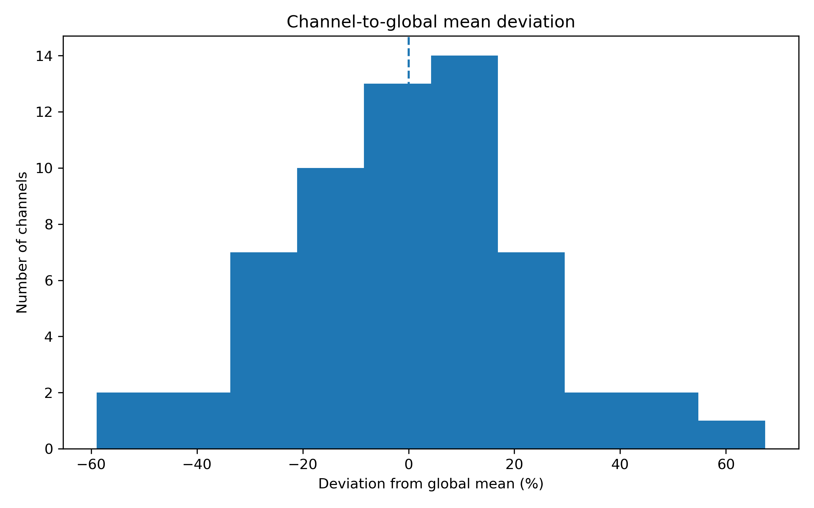
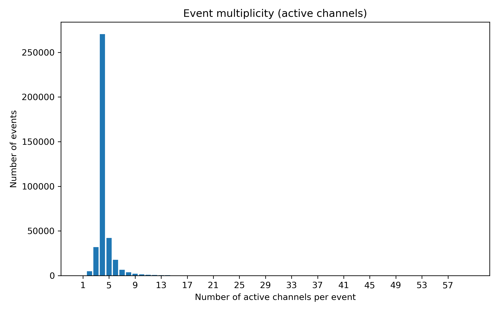
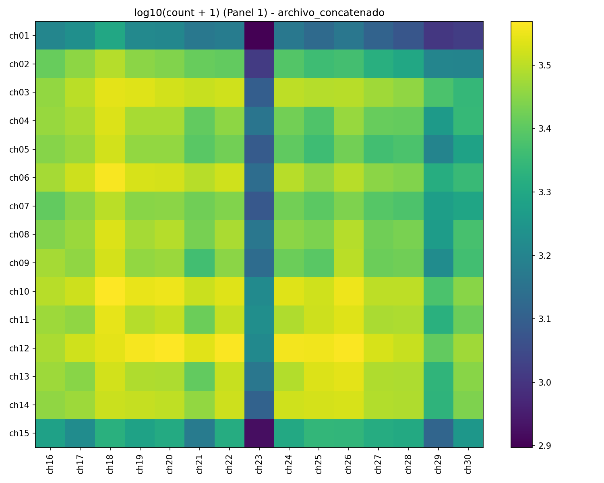

# MuTe_Instrumento

Scripts para **procesamiento y diagnóstico** de datos del detector **MuTe 2.1** en CSV.

Incluye:
- Conversión de salidas CAEN Janus/FERS en modo **shaping** (hits por trigger) → formato MuTe **wide** (`time + ch00..ch63`).
- Concatenación eficiente de múltiples CSV (streaming, sin cargar todo en RAM).
- Filtro de **coincidencias 2-fold y 4-fold** con **validación binaria (0/1)**.
- Análisis unificado:
  - **Tasa/estabilidad por canal** (por defecto `ch1..ch60`).
  - **Coincidencias por activación** (heatmaps, con 60 o 64 canales).
- Flujo 4-fold vs tiempo + histograma.
- Mapa discreto **(Δx,Δy)** y mapa angular **(θx,θy)** para eventos 4-fold.

---

## Instalación

Requisitos:
- Python **3.9+** (recomendado 3.10+)

Instala dependencias:

```bash
python3 -m pip install -r requirements.txt
```

> Opcional: si instalas `pyarrow`, `analisis_global.py` puede leer CSV más rápido con `--engine pyarrow`.

---

## Formato de entrada

### 1) Formato MuTe “wide” (principal)
CSV con una columna temporal (por defecto `time`) y columnas `chNN`.

Notas importantes (consistencia):
- `modulos/filtro_coincidencias.py` define **HIT = (valor == 1)** y por defecto **elimina filas** con valores fuera de `{0,1}` en cualquier canal.
- `analisis_global.py` (parte de coincidencias) considera activación como **(valor != 0)**.
- `angulo_volteado.py` requiere columnas **exactas** `ch00..ch63` (64 canales), porque usa `usecols=["time"] + [ch00..ch63]`.

### 2) Formato “shaping” (CAEN Janus/FERS)
Archivos con comentarios tipo `//Start_Time_Epoch:...` y columnas como `TStamp_us, Trg_Id, CH_Id`.
Se convierten a MuTe-wide con `modulos/traduccionMuTe.py`.

---

## Estructura

```text
.
├── analisis_global.py
├── angulo_volteado.py
├── bajar.sh
├── flujo_4fold.py
├── histograma_4fold.py
├── example_data_coinc4.csv
└── modulos/
    ├── filtro_coincidencias.py
    ├── traduccionMuTe.py
    └── unircsv.py
```

---

## Quickstart (pipeline típico)

### 1) (Opcional) Convertir shaping → MuTe-wide

```bash
python3 modulos/traduccionMuTe.py input_shaping.csv -o salida_as_MuTe.csv
```

Si el archivo no incluye `//Start_Time_Epoch`:

```bash
python3 modulos/traduccionMuTe.py input_shaping.csv --start-epoch-ms 1771532477098
```

### 2) Unir CSVs (concatenación)

```bash
python3 modulos/unircsv.py ./carpeta_con_csvs -o archivo_concatenado.csv
```

Verificar que todos tengan el mismo header:

```bash
python3 modulos/unircsv.py ./carpeta_con_csvs -o archivo_concatenado.csv --verify-header
```

### 3) Filtrar coincidencias (2-fold / 4-fold) y validar 0/1

Genera `*_coinc4.csv` y un reporte `*_filter_report.txt`:

```bash
python3 modulos/filtro_coincidencias.py archivo_concatenado.csv
```

Generar además `*_coinc2.csv`:

```bash
python3 modulos/filtro_coincidencias.py archivo_concatenado.csv --write-coinc2
```

Exigir además que en `ch01..ch60` haya **exactamente 4 hits** (sin hits extra en ese bloque):

```bash
python3 modulos/filtro_coincidencias.py archivo_concatenado.csv --strict-4fold
```

Forzar canales a 0 (ej. `7` y `59`):

```bash
python3 modulos/filtro_coincidencias.py archivo_concatenado.csv --zero-ch "7,59"
```

### 4) Análisis global (tasa + coincidencias por activación)

```bash
python3 analisis_global.py archivo_concatenado.csv
```

Solo tasa:

```bash
python3 analisis_global.py archivo_concatenado.csv --only rate
```

Solo coincidencias:

```bash
python3 analisis_global.py archivo_concatenado.csv --only coinc
```

Si tus canales empiezan en `ch00`:

```bash
python3 analisis_global.py archivo_concatenado.csv --only coinc --channels-start 0
```

Todas las salidas se guardan en:

```text
<carpeta_del_csv>/graficas_<stem>/
```

### 5) Flujo 4-fold vs tiempo (a partir de `*_coinc4.csv`)

```bash
python3 flujo_4fold.py archivo_concatenado_coinc4.csv --area 0.36
```

Opciones útiles:
- `--channels-start` (1 si `ch01..`, 0 si `ch00..`)
- `--chunk-size`
- `--n-bars` (15 por defecto)

### 6) Histograma del flujo 4-fold

```bash
python3 histograma_4fold.py archivo_concatenado_coinc4.csv --area 0.36
```

### 7) Mapa de píxeles y mapa angular (requiere `ch00..ch63`)

```bash
python3 angulo_volteado.py salida_as_MuTe.csv --distance-cm 70 --pitch-cm 4
```

Este script:
- Usa canales 1–60 con el mapping:
  - X superior: `ch01..ch15`
  - Y superior: `ch16..ch30`
  - X inferior: `ch31..ch45`
  - Y inferior: `ch46..ch60`
- Exige **exactamente 1 hit por plano**
- Aplica por defecto un **flip** en `Y inferior` (para corregir cableado invertido en algunas corridas).

---

## Descarga + extracción + preprocesado automático (SSH)

`bajar.sh` automatiza:
1) Lista y descarga `.tar.xz` remotos por fecha/prefijo.
2) Extrae.
3) (Opcional) Corre `unircsv.py` + `filtro_coincidencias.py`.

Uso (nota: `--scriptsdir` debe apuntar a la carpeta que contiene `unircsv.py` y `filtro_coincidencias.py`, o sea `./modulos`):

```bash
bash bajar.sh --date YYYYMMDD --scriptsdir ./modulos --outdir ./salida
```

Ejemplo:

```bash
bash bajar.sh --date 20251226 --scriptsdir ./modulos --outdir ./datos_20251226
```

Ayuda:

```bash
bash bajar.sh --help
```

---

## Ejemplos de salida (imágenes)

Para que se vean en GitHub, este README asume que copiaste algunos PNGs de
`graficas_*/` a una carpeta `images/` dentro del repo (o ajusta las rutas).

### Flujo 4-fold vs tiempo


### Histograma del flujo 4-fold


### Mapa de píxeles (Δx,Δy)


### Tasa por canal (rolling) y diagnósticos




### Heatmap de coincidencias por activación (ejemplo)


---

## Licencia

CC0 1.0 Universal. Ver `LICENSE`.
